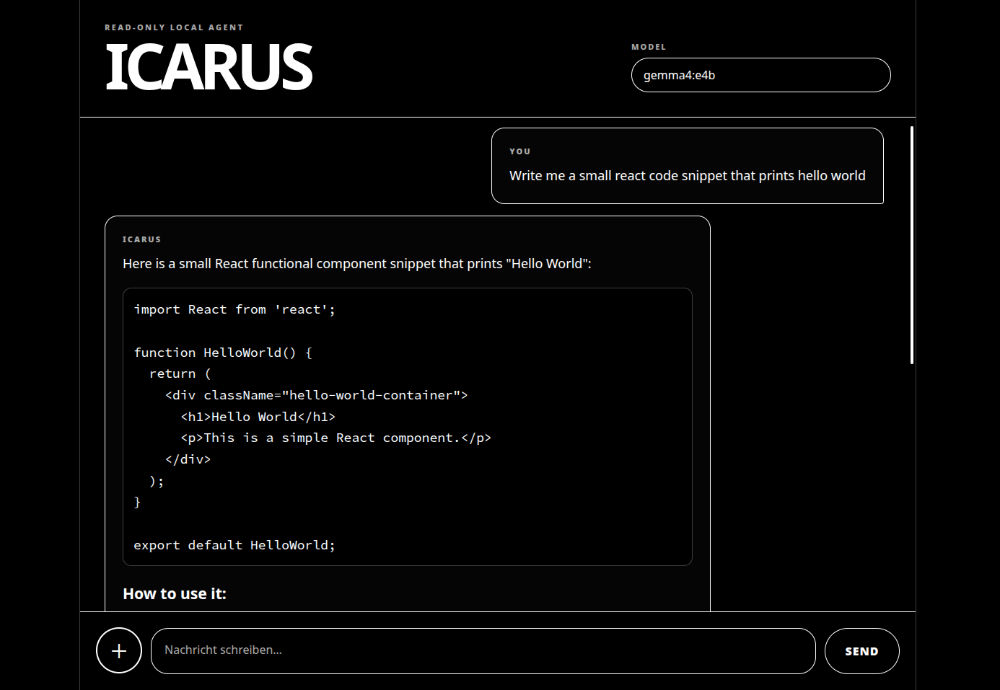

# 🧠 Icarus Local AI Agent



**Icarus** is a self-hosted local AI assistant powered by Ollama.  
It runs on your own machine, provides a responsive web chat UI, supports uploads, structured memory, vector memory, read-only file tools, and human-approved terminal commands.

> ⚠️ This project is experimental and intended for trusted local use only.

---

## ✨ Features

- 🏠 **Local-first AI assistant** using Ollama
- 💬 **Responsive web chat UI** built with Flask, HTML, CSS and vanilla JavaScript
- 🧠 **Structured profile memory** for stable user facts
- 🔎 **Vector memory** using FAISS + sentence-transformers
- 📎 **File uploads inside the chat UI**
- 📄 **PDF reading tool**
- 📝 **Word `.docx` reading tool**
- 🖼️ **Image metadata + optional OCR support**
- 📊 **CSV and JSON reading tools**
- 📁 **Read-only directory/file inspection**
- 🌐 **Web fetching** with `fetch_url` (simple HTML to text)
- 🔍 **Web search and scraping** with Firecrawl API
- 🧑‍⚖️ **Human-in-the-loop terminal approval**
- ⏱️ **Response time display**
- 🔢 **Token usage display**
- ⚫⚪ **Minimal black-and-white responsive design**

---

## 🧩 What This Project Is

Icarus is a local AI agent that can:

1. talk to you through a browser-based chat interface,
2. use a local Ollama model,
3. remember stable information,
4. inspect uploaded files,
5. request read-only terminal commands,
6. wait for your approval before executing commands.

The core idea:

```text
The model may suggest actions.
The user approves actions.
The backend enforces boundaries.
```

---

## 🚨 Security Notice

This project can execute shell commands on your machine **after explicit user approval**.

Use it carefully.

### Do not:

- expose this server to the public internet,
- run it with `sudo`, root, or administrator privileges,
- store secrets in folders the agent can inspect,
- allow destructive commands,
- trust model-generated shell commands blindly.

### Recommended:

- run only on a trusted local network,
- keep access read-only by default,
- review every command before approving it,
- use a separate low-privilege user account if possible,
- keep uploads and memory files out of Git.

No local AI agent with shell access should be considered perfectly safe.

---

## 🏗️ Architecture

```text
Browser UI
   ↓
Flask Backend
   ↓
Ollama Local Model
   ↓
Tool Request / Command Request
   ↓
Python Tool Layer OR User Approval
   ↓
Result returned to model
   ↓
Final answer shown in chat
```

---

## 📂 Project Structure

```text
.
├── main.py
├── tools.py
├── requirements.txt
├── ALLOWED_COMMANDS.md
├── README.md
├── .gitignore
├── templates/
│   └── index.html
├── static/
│   └── style.css
├── memory/
│   └── .gitkeep
└── uploads/
    └── .gitkeep
```

---

## ⚙️ Requirements

- Python 3.10+
- Ollama installed and running
- At least one local Ollama model
- Linux/macOS recommended
- (Optional) Firecrawl API key for web search and scraping

Recommended models:

| Use case | Model |
|---|---|
| General local assistant | `qwen2.5:14b` |
| Coding-heavy tasks | `qwen2.5-coder:14b` |
| Stronger coding model | `qwen3-coder:30b` |
| Lightweight testing | `gemma3:4b` |

Example:

```bash
ollama pull qwen2.5-coder:14b
```

---

## 🚀 Installation

Clone the repository:

```bash
git clone https://github.com/YOUR_USERNAME/icarus-local-ai-agent.git
cd icarus-local-ai-agent
```

Create a virtual environment:

```bash
python3 -m venv venv
source venv/bin/activate
```

Install dependencies:

```bash
pip install -r requirements.txt
```

(Optional) Set up environment variables for Firecrawl:

Create a `.env` file in the project root:

```bash
FIRECRAWL_API_KEY=your_api_key_here
```

Get a free Firecrawl API key at [firecrawl.dev](https://firecrawl.dev). Without this key, web search and scraping features will not work.

Start Ollama:

```bash
ollama serve
```

Start Icarus:

```bash
python main.py
```

Open in your browser:

```text
http://localhost:5000
```

For local network access:

```text
http://YOUR_LOCAL_IP:5000
```

---

## 📦 Dependencies

Current `requirements.txt`:

```txt
flask
requests
faiss-cpu
sentence-transformers
werkzeug
beautifulsoup4
python-dotenv
lxml
```

Additional optional dependencies for extended features:

```txt
pypdf          # PDF reading
python-docx    # Word document reading
pillow         # Image handling
pytesseract    # OCR support
```

OCR requires the system package `tesseract-ocr`.

On Debian/Ubuntu:

```bash
sudo apt install tesseract-ocr
```

---

## 🧠 Memory System

Icarus uses two memory layers.

### 1. Structured Profile Memory

Stored in:

```text
memory/profile_memory.json
```

Used for high-confidence facts such as:

- name,
- profession,
- preferences,
- hardware,
- skills,
- interests.

This is better for facts like:

```text
My name is Max.
I prefer short answers.
I use Linux.
```

### 2. Vector Memory

Stored in:

```text
memory/memory_texts.json
memory/memory_index.faiss
```

Used for softer long-term context and recurring topics.

Vector memory is useful, but it should not be trusted as the only source for identity facts like a user name.

---

## 📎 Uploads

Uploaded files are stored locally in:

```text
~/icarus_uploads
```

The chat UI sends uploaded file metadata to the model so it can request the correct tool.

Supported file inspection tools:

- `read_pdf` - Extract text from PDF files
- `read_docx` - Extract text from Word documents
- `read_image_metadata` - Get image metadata (visual analysis via Ollama)
- `read_csv` - Read CSV files with preview
- `read_json` - Read JSON files
- `read_text_file` - Read text-based files
- `list_directory` - List directory contents
- `file_info` - Get file metadata
- `search_text` - Search within text files
- `hash_file` - Calculate file checksums

---

## 🛠️ Tool System

For file inspection, Icarus should prefer dedicated Python tools over shell commands.

### Available Tools

#### File & Directory Tools

- **`file_info`**: Return metadata for a file or directory
- **`list_directory`**: List files and folders inside a directory (with optional recursive mode)
- **`read_text_file`**: Read plain text, markdown, code, logs and similar text files
- **`search_text`**: Search for a string or regex pattern inside a text-readable file
- **`hash_file`**: Calculate sha256 hash of a file

#### Document Reading Tools

- **`read_pdf`**: Extract text from a PDF file with metadata
- **`read_docx`**: Extract text and tables from a Word `.docx` document
- **`read_csv`**: Read a CSV file with preview and basic stats
- **`read_json`**: Read and parse a JSON file

#### Image & Media Tools

- **`read_image_metadata`**: Return image metadata. Visual understanding is handled by sending images directly to Ollama.

#### Web Tools

- **`fetch_url`**: Fetch and extract readable text from a webpage using BeautifulSoup
- **`firecrawl_search`**: Search the web with Firecrawl and optionally scrape markdown content from results
  - Args: `query` (required), `limit` (optional, default 3, max 10), `scrape` (optional, default true)
  - Requires: FIRECRAWL_API_KEY environment variable
- **`firecrawl_fetch_url`**: Fetch a single webpage with Firecrawl and return clean markdown
  - Args: `url` (required, must start with http:// or https://)
  - Requires: FIRECRAWL_API_KEY environment variable

### Tool Request Example

```json
{
  "type": "tool_request",
  "tool": "read_pdf",
  "args": {
    "path": "/home/user/icarus_uploads/example.pdf"
  }
}
```

The backend runs the tool and sends the result back to the model.

This is safer and more reliable than asking the model to invent shell commands for every file type.

---

## 🖥️ Terminal Approval

For terminal access, the model must request a command.

Example:

```json
{
  "type": "command_request",
  "command": "ls -la ~/Projects",
  "reason": "I need to inspect the project directory."
}
```

The backend does not execute this automatically.

Flow:

```text
Model requests command
→ UI shows command and reason
→ User approves or denies
→ Backend validates command
→ Command runs only if allowed
→ Output goes back to the model
```

---

## ✅ Command Philosophy

Commands should be:

- read-only,
- inspectable,
- limited to the home folder,
- explicitly approved,
- blocked if risky.

Allowed examples:

```bash
ls
pwd
find
grep
cat
head
tail
stat
wc
du
df
file
uname
whoami
date
```

Blocked examples:

```bash
rm
rmdir
mv
cp
chmod
chown
sudo
curl
wget
ssh
scp
dd
mkfs
shutdown
reboot
```

---

## 📜 ALLOWED_COMMANDS.md

Use `ALLOWED_COMMANDS.md` to document the intended command policy.

Recommended structure:

```md
# Allowed Commands

These commands are intended for read-only inspection only.

## Directory inspection
- ls
- pwd
- find
- tree

## File inspection
- cat
- head
- tail
- file
- stat
- wc

## Search
- grep
- egrep
- fgrep

## System info
- date
- uname
- whoami
- id
- hostname
- df
- du
- free
- lscpu
```

The Markdown file is documentation. The backend must still enforce command validation in Python.

---

## 🧪 Development Notes

This project started as a rapid local AI experiment and is evolving toward a safer local-agent architecture.

The most important design correction:

```text
Do not use shell for everything.
Use dedicated tools for structured tasks.
```

Examples:

| Task | Better approach |
|---|---|
| Read PDF | `read_pdf` tool |
| Read Word doc | `read_docx` tool |
| Read image metadata | `read_image` tool |
| Inspect folders | `list_directory` tool or approved `ls` |
| Search text | `search_text` tool or approved `grep` |
| System info | safe read-only commands |

---

## 🧯 Troubleshooting

### Ollama is not reachable

Make sure Ollama is running:

```bash
ollama serve
```

### No models appear

Check installed models:

```bash
ollama list
```

Pull a model:

```bash
ollama pull qwen2.5-coder:14b
```

### PDF reading fails

Install:

```bash
pip install pypdf
```

### Word files fail

Install:

```bash
pip install python-docx
```

### Image reading fails

Install:

```bash
pip install pillow
```

### OCR fails

Install Python dependency:

```bash
pip install pytesseract
```

Install system dependency:

```bash
sudo apt install tesseract-ocr
```

---

## 🗺️ Roadmap

Potential improvements:

- 🔐 real sandboxing
- 👤 authentication for LAN access
- 🧰 stricter command parser
- 📁 per-folder permissions
- 🧠 memory editor UI
- 🧹 memory delete controls
- 🔄 streaming responses
- 📚 multi-file context selection
- 🧪 tests for command validation
- 📦 Docker setup
- 🧭 better tool-call protocol
- 🪪 user/session separation

---

## ❌ Not Production Ready

This project is not intended for production deployment.

It is best used as:

- a learning project,
- a local AI playground,
- a prototype for local tool-using agents,
- a personal workstation assistant.

---

## 📄 License

[MIT](LICENSE.md)

---

## 🙏 Credits

Built around the idea of a local-first AI assistant that keeps the user in control.

Human approval remains the safety boundary.
